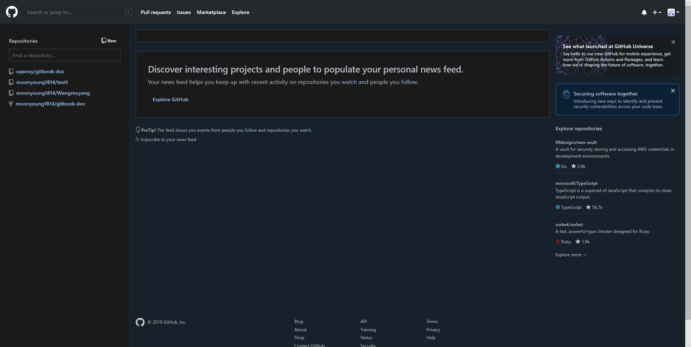

# 浏览器插件

浏览器插件是通过安装一些功能性插件，将其嵌入在浏览器内，来增加浏览器的功能，如翻译、截图、代理服务器等功能的插件。

## Translator For Microsoft Edge

该插件可以自动把网站上的外语翻译成中文，解决了Microsoft Edge不能自动翻译的问题。该插件支持60多种语言。

## Night Eye

该插件可以将任何网站转换成夜间模式，从而可以在较暗的环境下保护用户的眼睛

